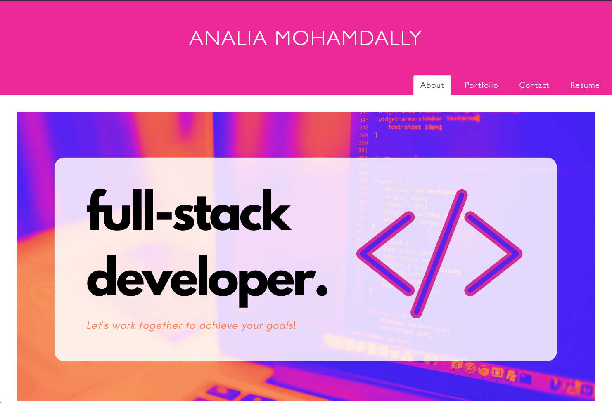
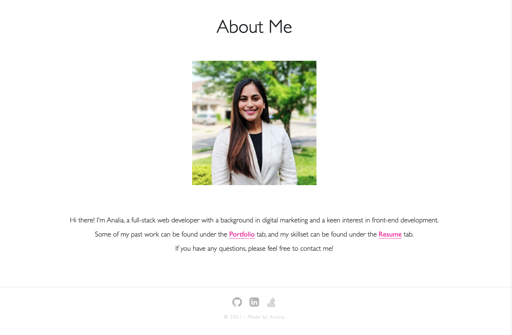
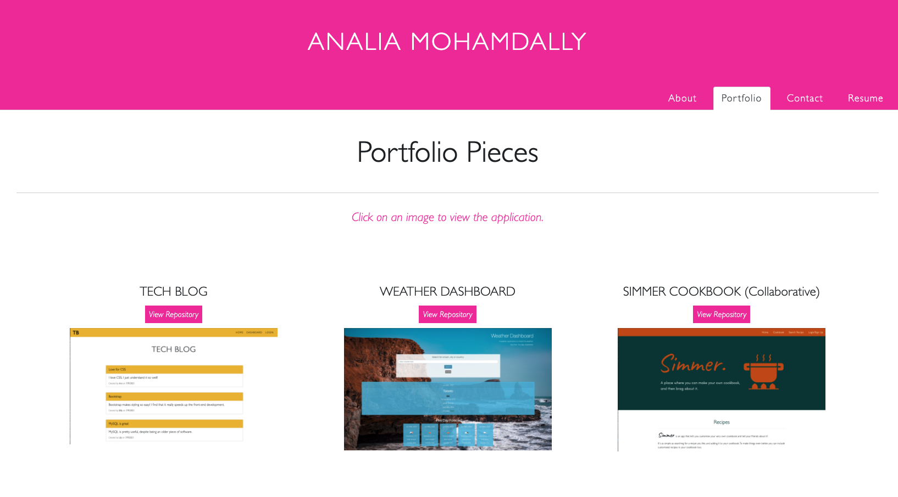
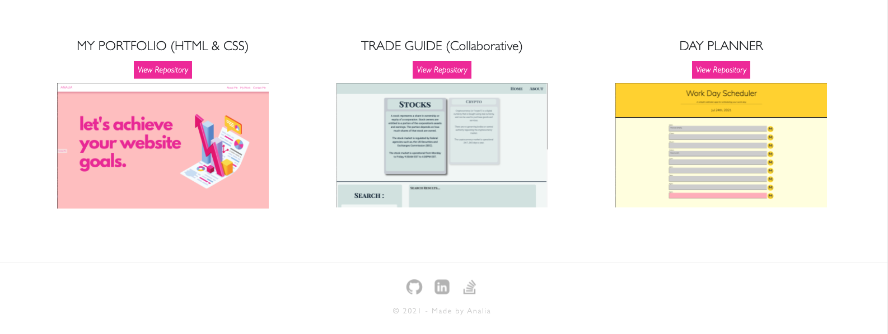
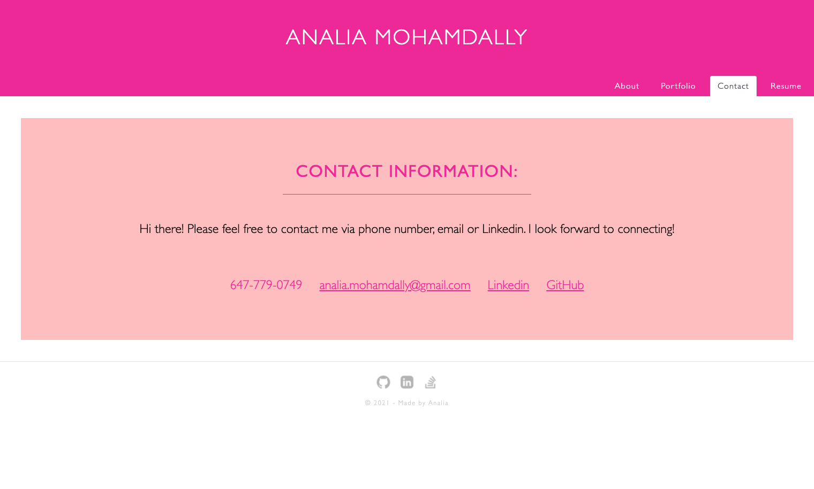
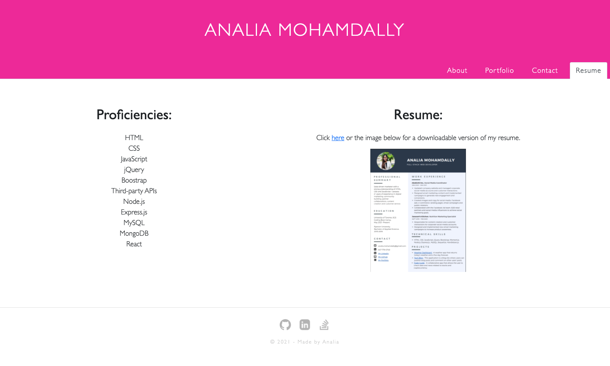

# React_Portfolio

  [](https://opensource.org/licenses/MIT)

  ## Description
  This application is my Portfolio and it was made using React.js. It renders multiple components that include pages, "About Me", "Portfolio", "Contact Me" and "Resume". A brief background about myself, some of my past projects, my proficiencies and resume as well as a contact form can be found in this React.js application. 
  

  # Table of Contents
  - [Installation Instructions](#installation-instructions)
  - [Usage Instructions](#usage)
  - [Test Instructions](#tests)
  - [Contributing](#contributing)
  - [License](#license)
  - [Questions](#questions)

  # Installation Instructions
  To install this application, clone the repository to your local device and run ```npm i``` in the terminal to install the dependencies.To start the application, run ```npm start```.

  # Usage
  To view the application, click on the deployed link above. Once the application is open, click on the different tabs to view the respective content. Please note that the contact form under the "Contact" tab does not store any information.
  
  
  
  
  
  

  # Tests
  There are no tests included in this project.

  # Contributing
  There are no other collaborators. If you would like to contribute, please feel free to reach out to me! My contact information can be found below.

  # License
  Click on the badge to learn more about this license:

  [](https://opensource.org/licenses/MIT)
  
  # Questions
  If you have any questions about this application, please reach out to me at: 

  - Email: analia.mohamdally@gmail.com
  - GitHub: AnaMolly, https://github.com/AnaMolly
